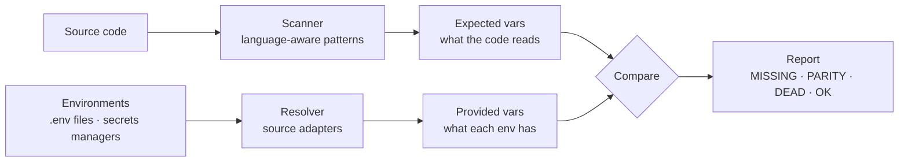
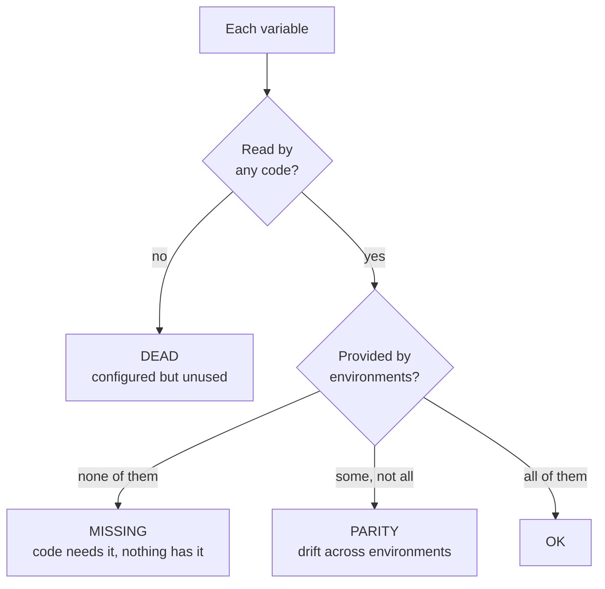
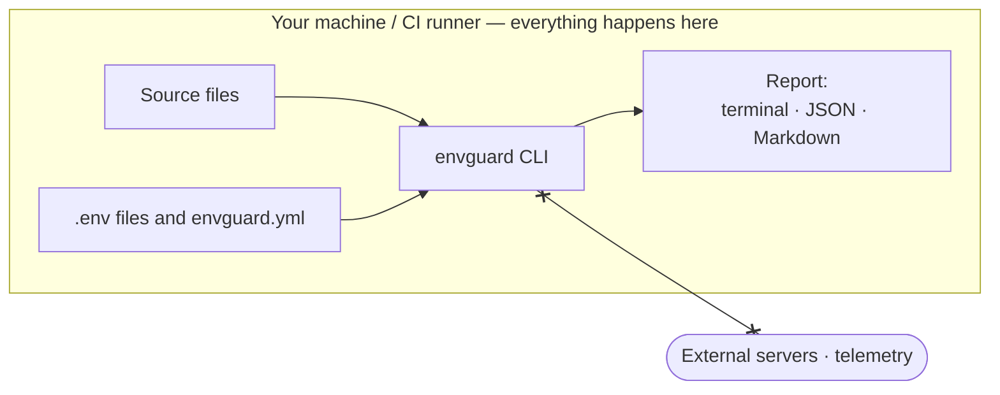
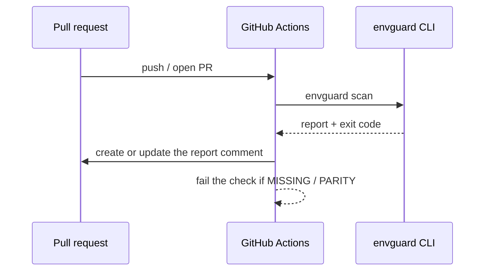

<p align="center">
  <picture>
    <source media="(prefers-color-scheme: dark)" srcset="assets/envguard-logo-dark.svg" />
    
  </picture>
</p>

<p align="center">
  <strong>Know that every environment variable your code needs is configured in every environment — before you deploy.</strong>
</p>

<p align="center">
  EnvGuard statically analyzes your codebase to inventory every environment variable it reads, then cross-references that list against what each of your environments actually provides — surfacing <em>missing</em> variables, staging/production <em>parity drift</em>, and <em>dead</em> configuration no code uses anymore.
</p>

<p align="center">
  <a href="https://www.npmjs.com/package/@rinorhatashi/envguard"></a>
  <a href="https://github.com/rinorhatashi/EnvGuard/actions/workflows/ci.yml"></a>
  <a href="./LICENSE"></a>
  
</p>

<p align="center">
  <a href="#what-it-does">What it does</a> •
  <a href="#how-it-works">How it works</a> •
  <a href="#runs-entirely-on-your-machine">Local &amp; private</a> •
  <a href="#install">Install</a> •
  <a href="#configuration">Configuration</a> •
  <a href="#github-action">GitHub Action</a>
</p>

---

## The problem

"It works on staging but breaks in production" is one of the most common — and most avoidable — deployment failures, and environment misconfiguration is a leading cause. The problem is structural:

- Your **code** declares what it needs: `process.env.STRIPE_WEBHOOK_SECRET`, `os.environ["DATABASE_URL"]`.
- Your **infrastructure** declares what it has: secrets in AWS, Vercel, Doppler, a `.env` file.
- **Nothing checks that the two lists agree.**

So variables drift out of sync. One gets added to production at 3am during an incident and never backfilled to staging. One gets deleted from the code but lingers in every secrets manager for years. A new service ships to production missing a variable nobody knew to add.

Existing tools don't close this gap. Dotenv linters (`dotenv-linter`, `dotenv-safe`) only compare a single local `.env` against `.env.example`. Infrastructure drift tools (`driftctl`, Terragrunt) only compare cloud resources against Terraform state — not application-level variable usage. **EnvGuard is the missing link between what the code reads and what every environment provides.**

## What it does

EnvGuard reduces the entire question — *"is every environment configured correctly for this code?"* — to one command, `envguard scan`, and one report with four verdicts:

| Status | Meaning | The failure it prevents |
| :--- | :--- | :--- |
| 🔴 **`MISSING`** | The code reads it, but **no** environment provides it. | A guaranteed crash the moment that code path runs. |
| 🟡 **`PARITY`** | Present in **some** environments but not others. | The classic "works on staging, breaks in production" drift. |
| ⚪ **`DEAD`** | Configured in an environment but **no** code reads it. | Secret sprawl and config rot — stale values that mislead. |
| 🟢 `OK` | Read by the code and present everywhere. | Nothing to do. |

Run it locally before a deploy, or wire up the [GitHub Action](#github-action) to post the report on every pull request and fail the build when something is missing or drifting.

## How it works

EnvGuard is a three-stage pipeline. It performs **pure static analysis** — your code is never executed, so the scan is fast and safe to run anywhere, including untrusted CI.



**1. Scan — build the manifest of what the code expects.**
EnvGuard walks your source tree and applies a set of language-aware patterns to every supported file, extracting each environment-variable reference together with its file and line number. There's no build step and nothing is run; it simply reads source. The output is the *expected* manifest — the complete set of variables your code depends on.

**2. Resolve — find out what each environment provides.**
For every environment you configure, a **source adapter** reports the set of variable *names* that environment supplies. The built-in `dotenv` adapter reads the keys from a `.env` file; planned adapters query secrets managers like AWS SSM, Vercel, and Doppler. EnvGuard only ever reads variable **names — never secret values**. With no configuration at all, it auto-discovers local `.env.*` files and treats each as an environment.

**3. Compare — cross-reference and classify.**
EnvGuard builds a matrix of *what the code needs* against *what each environment has* and assigns every variable a status. `ignore` rules in your config demote intentional cases (an environment-specific flag, an allowed legacy var) to `OK`, and the `failOn` setting decides which statuses cause a non-zero exit so CI can gate on them.

Each variable lands in exactly one bucket:



The report is then rendered three ways — a colored terminal table for humans, JSON for tooling, and Markdown for pull-request comments.

## Runs entirely on your machine

EnvGuard is local-first: **no hosted service, no account, no telemetry.** The `envguard` CLI makes **no network calls** — it reads your source and `.env` files from disk, analyzes them in-process, and writes a report. Nothing about your code or configuration is uploaded anywhere, because there's no reason for it to be.



- **Only names, never values.** EnvGuard compares variable *names*. It never reads, stores, or prints the secret values inside your `.env` files.
- **Future cloud sources stay direct.** Planned adapters (AWS SSM, Vercel, Doppler, …) will talk **directly** to your own provider with your own credentials to list variable names — still no third-party server in the middle, and still names only.

## Install

```bash
npm install -g @rinorhatashi/envguard
```

…or run it without installing:

```bash
npx @rinorhatashi/envguard scan
```

Requires **Node.js 18 or newer**.

## Quick start

From a project that has `.env.staging` and `.env.production` files, EnvGuard works with **zero configuration** — it discovers them automatically:

```bash
envguard scan
```

Point it at a specific directory and/or config file:

```bash
envguard scan ./services/api --config envguard.yml
```

### Try the bundled demo

The repository ships a demo with source files in all five supported languages and two diverging environments:

```bash
git clone https://github.com/rinorhatashi/EnvGuard
cd EnvGuard
npm install && npm run build
node dist/index.js scan examples/demo
```

## Example output

```text
EnvGuard  ·  scanned 5 files  ·  2 environments (staging, production)

VARIABLE               CODE  staging  production  STATUS
STRIPE_WEBHOOK_SECRET   ✓       ✗         ✗       MISSING
API_KEY                 ✓       ✓         ✗       PARITY
DEBUG                   –       ✓         ✗       DEAD
LEGACY_TOKEN            –       ✓         ✓       DEAD
DATABASE_URL            ✓       ✓         ✓       OK
REDIS_URL               ✓       ✓         ✓       OK
SENDGRID_API_KEY        ✓       ✓         ✓       OK

  1 missing · 1 parity · 2 dead · 3 ok

  MISSING  STRIPE_WEBHOOK_SECRET — read at src/billing.ts:3, not set in any environment
  PARITY   API_KEY — set in staging; missing in production (read at app/server.py:5)
  DEAD     DEBUG — set in staging but not read by any scanned file
  DEAD     LEGACY_TOKEN — set in staging, production but not read by any scanned file
```

The same report, as machine-readable JSON or as a Markdown PR comment:

```bash
envguard scan --format json
envguard scan --format markdown
```

## Supported languages

Each language is matched with its own idiomatic access patterns. Adding a language is a small, self-contained change to [`src/scan/patterns.ts`](src/scan/patterns.ts).

| Language | Extensions | Detected forms |
| :--- | :--- | :--- |
| Node.js / TypeScript | `.js` `.jsx` `.mjs` `.cjs` `.ts` `.tsx` `.mts` `.cts` | `process.env.X`, `process.env['X']`, `import.meta.env.X` |
| Python | `.py` | `os.environ['X']`, `os.environ.get('X')`, `os.getenv('X')` |
| Ruby | `.rb` `.erb` `.rake` | `ENV['X']`, `ENV.fetch('X')` |
| Go | `.go` | `os.Getenv("X")`, `os.LookupEnv("X")` |
| Rust | `.rs` | `std::env::var("X")`, `env::var("X")`, `std::env::var_os("X")` |

## Configuration

EnvGuard runs with zero config, but an `envguard.yml` at your project root unlocks declared environments, ignore rules, and CI behavior. **Every field is optional.**

```yaml
# Which environments to compare, and where to read each one's variable names.
environments:
  staging:
    source: dotenv
    path: .env.staging
  production:
    source: dotenv
    path: .env.production

# Statuses that make `envguard scan` exit non-zero. Defaults to MISSING + PARITY.
failOn:
  - MISSING
  - PARITY

# Silence intentional findings by listing variable names.
ignore:
  parity:
    - DEBUG          # intentionally environment-specific — don't flag drift
  dead:
    - LEGACY_TOKEN   # allowed legacy var during a cleanup sprint
  missing:
    - OPTIONAL_VAR   # read by code but not required in any environment

# Narrow what gets scanned. Defaults to every supported file under the root.
scan:
  include:
    - "src/**"
    - "app/**"
  exclude:
    - "**/*.test.ts"
```

If `environments` is omitted, EnvGuard auto-discovers them from local `.env.*` files (`.env` → `local`, `.env.staging` → `staging`, …), skipping `.example`, `.sample`, and `.local` files.

## Sources

A **source** answers a single question: *"which variables does this environment provide?"* Adapters implement one small interface ([`src/sources/types.ts`](src/sources/types.ts)) and only ever read variable **names**, never secret values — so coverage grows without touching the core.

| Source | Status | Configuration |
| :--- | :--- | :--- |
| `dotenv` — local `.env` files | ✅ Available | `path: .env.<environment>` |
| AWS SSM Parameter Store | 🔜 Planned | — |
| GitHub Actions secrets | 🔜 Planned | — |
| Vercel | 🔜 Planned | — |
| Doppler | 🔜 Planned | — |
| Railway / Render | 🔜 Planned | — |

## CLI reference

```
envguard scan [path]

Arguments:
  path                    directory to scan (default: ".")

Options:
  -c, --config <file>     path to an envguard.yml config file
  -f, --format <format>   output format: table | json | markdown (default: table)
  -o, --output <file>     write the report to a file instead of stdout
  --fail-on <list>        statuses that cause a non-zero exit:
                          missing, parity, dead, none (default: missing,parity)
  --no-color              disable colored output
  -v, --version           print the EnvGuard version
  -h, --help              show help
```

### Exit codes

EnvGuard is built to gate a pipeline:

| Code | Meaning |
| :---: | :--- |
| `0` | No findings in the `fail-on` set. |
| `1` | At least one finding in the `fail-on` set (e.g. a `MISSING` or `PARITY` variable). |
| `2` | EnvGuard errored (bad config, unreadable path, …). |

## GitHub Action

Run EnvGuard on every pull request. It posts the report as a comment that updates in place on each push:



Copy [`examples/github-workflow.yml`](examples/github-workflow.yml) to `.github/workflows/envguard.yml`:

```yaml
name: EnvGuard
on:
  pull_request:
  push:
    branches: [main]

jobs:
  envguard:
    runs-on: ubuntu-latest
    permissions:
      contents: read
      pull-requests: write # required to post the report comment
    steps:
      - uses: actions/checkout@v4
      - uses: rinorhatashi/EnvGuard@v1
        with:
          working-directory: .
          # config: envguard.yml
          # fail-on: missing,parity
```

When a `fail-on` status is present, the job fails — turning environment drift into a red check instead of a 3am page.

| Input | Description | Default |
| :--- | :--- | :--- |
| `working-directory` | Directory to scan. | `.` |
| `config` | Path to an `envguard.yml`. | _(auto)_ |
| `fail-on` | Statuses that fail the job. | _(from config / defaults)_ |
| `comment` | Post/update the PR comment. | `true` |
| `version` | `envguard` npm version to run. | `latest` |
| `github-token` | Token used to post the comment. | `${{ github.token }}` |

## Roadmap

- Source adapters for AWS SSM, GitHub Actions secrets, Vercel, Doppler, Railway, and Render.
- Destructuring (`const { FOO } = process.env`) and comment-aware scanning.
- SARIF output for GitHub code scanning, and a `--baseline` file to accept existing findings.
- More languages (Java, PHP, .NET, Elixir).

## Contributing

EnvGuard is designed to be extended in small, isolated pieces:

- **Add a language** — append a pattern set to [`src/scan/patterns.ts`](src/scan/patterns.ts) and a test to [`test/extract.test.ts`](test/extract.test.ts).
- **Add a source** — implement the `SourceAdapter` interface and register it in [`src/sources/index.ts`](src/sources/index.ts).

```bash
npm install
npm test                            # run the test suite
npm run build                       # compile to dist/
npm run dev -- scan examples/demo   # run straight from source
```

## License

[MIT](./LICENSE) © Rinor Hatashi
